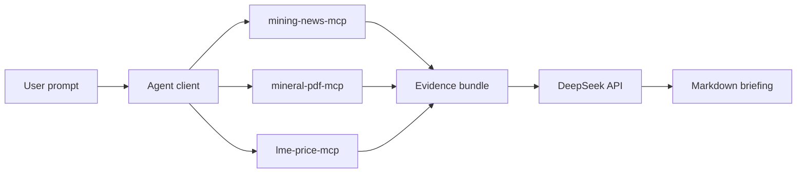

# Mineral Daily Agent

Python MCP project for interview task #2: a "mineral rights daily agent" that
generates a Markdown briefing from mining news, mineral resource data, and price
trend tools.

## What It Delivers

- Three MCP stdio servers:
  - `mining-news-mcp`: `search(query, days)`, `fetch_article(url)`
  - `mineral-pdf-mcp`: `extract_resources(pdf_url)`
  - `lme-price-mcp`: `get_price(commodity, date_value)`, `get_trend(commodity, days)`
- One Agent client that orchestrates the MCP tools and calls DeepSeek.
- `mcp-config.json` for Claude Desktop / Cursor style MCP configuration.
- `RUN.md` with a 5-minute Docker Compose path.

## Architecture



## Quick Start

```bash
cp .env.example .env
# edit .env and set DEEPSEEK_API_KEY
docker compose run --rm agent "给我生成一份关于 Pilbara 锂矿的今日简报"
```

See `RUN.md` for the exact interview-run checklist.

## Local Development

```bash
python -m venv .venv
.\.venv\Scripts\Activate.ps1
pip install -e ".[dev]"
pytest
ruff check .
mypy src
```

## Design Notes

The default execution path is fixture-first so the interview demo does not fail
because of news-site anti-crawling, paid price feeds, or large PDF downloads.
Live HTTP/PDF support is included as an enhancement path, but the 5-minute run
does not depend on external mining data sources. DeepSeek is the only required
external service for final briefing generation.
